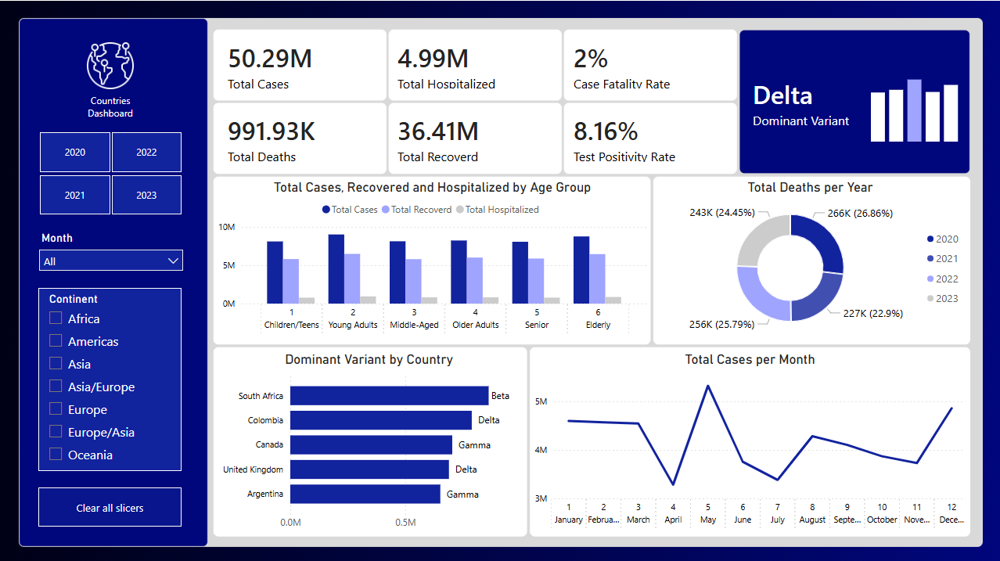
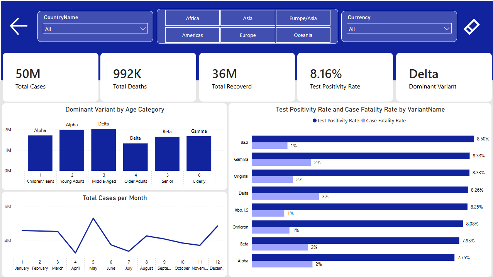

# COVID-19 Global Analytics Dashboard

An interactive, multi-page Power BI dashboard analyzing global COVID-19 trends across 50M+ cases, 25 countries, 8 virus variants, and 8 vaccines — spanning 2020 through 2023. The report is designed to support epidemiological decision-making by surfacing variant behavior, age-group risk profiles, and seasonal transmission patterns through a structured dimensional data model.

---

## Dashboard Preview

### Page 1 — Countries Overview


### Page 2 — Variants & Global Deep-Dive


---

## Data Model

The project follows a **Star Schema** architecture with one central fact table and five dimension tables, enabling flexible, high-performance slicing across all analytical dimensions.

```
Fact_Covid (5,050 rows)
├── Dim_Date        (48 rows  — monthly granularity, 2020–2023)
├── Dim_Country     (25 rows  — continent, sub-region, coordinates, currency)
├── Dim_Variant     (8 rows   — Pango lineage, relative severity, vaccine efficacy)
├── Dim_Vaccine     (8 rows   — vaccine type, manufacturer country, efficacy %)
└── Dim_AgeGroup    (6 rows   — age range, severity risk, vaccination rate)
```

### Fact Table — Measures

| Column | Description |
|---|---|
| NewCases | Confirmed new cases per period |
| NewDeaths | New deaths per period |
| NewRecovered | New recoveries per period |
| Hospitalized | Active hospitalizations |
| ICUAdmissions | ICU admissions |
| TestsConducted | Tests performed |
| VaccinationDoses | Doses administered |
| PositivityRate | Test positivity rate (%) |
| CFR_Pct | Case Fatality Rate (%) |

---

## Key Performance Indicators

| Metric | Value |
|---|---|
| Total Cases | 50.29M |
| Total Deaths | 991.93K |
| Total Recovered | 36.41M |
| Total Hospitalized | 4.99M |
| Case Fatality Rate | 2% |
| Test Positivity Rate | 8.16% |
| Dominant Variant (overall) | Delta |

---

## Analytical Findings

### Mortality Distribution
Death totals are distributed almost evenly across all four years, with 2021 recording the highest share at approximately 26.86% of cumulative deaths. This indicates that mortality pressure was not confined to the initial outbreak year but persisted at comparable levels through the vaccination rollout period, suggesting that vaccine availability alone did not immediately suppress fatality rates.

**Implication:** Public health resource allocation — particularly ICU capacity and mortality-response infrastructure — should be sustained across multi-year pandemic cycles rather than concentrated in the first year of emergence.

### Variant Geography
The Delta variant is dominant in the United Kingdom and Colombia; Gamma leads in Canada and Argentina; Beta is the primary variant in South Africa. This geographic clustering indicates that variant dominance is regionally segmented rather than globally uniform, which has direct consequences for targeted vaccine deployment and travel policy.

**Implication:** Country-level variant surveillance should inform continent-specific intervention strategies rather than a single global response framework.

### Variant Severity vs. Transmissibility
Ba.2 records the highest Test Positivity Rate at 8.50%, indicating the strongest transmissibility among all variants analyzed. Delta carries the highest Case Fatality Rate among high-prevalence variants at 3%, while Alpha, despite its early dominance, presents the lowest CFR at 2%. The Original strain and Gamma share a CFR of 2% with a Positivity Rate of 8.33%.

**Implication:** High positivity rates do not necessarily correlate with high fatality rates. Containment strategies should be differentiated — transmission control is most critical for high-positivity variants (Ba.2), whereas clinical resource prioritization should follow high-CFR variants (Delta).

### Age-Group Risk Profile
Middle-Aged adults (35–49) record the highest absolute case count across the dataset, with Delta as the dominant variant in that cohort. Elderly groups (65+) show relatively lower case counts but carry disproportionately higher severity risk scores. Children and Teens (0–17) have the lowest case burden and the lowest severity risk.

**Implication:** Vaccination campaigns and ICU preparedness should prioritize the 35–64 age band for case volume reduction, and the 65+ band for mortality prevention, rather than applying uniform age-group policies.

### Seasonal Transmission Patterns
Case volume exhibits two distinct peaks annually: a primary peak in May and a secondary peak in December. The trough consistently falls in February–April. This bimodal seasonal pattern holds across multiple years in the dataset.

**Implication:** Healthcare systems should pre-position testing capacity, hospitalization reserves, and public communication campaigns in advance of April and November — the months preceding each wave peak — rather than responding reactively once cases begin rising.

---

## Dashboard Pages

### Page 1 — Countries Dashboard

**Filters:** Year (2020–2023), Month, Continent

**Visuals:**
- Clustered bar chart — Total Cases, Recovered, and Hospitalized by Age Group
- Donut chart — Total Deaths distribution by Year (proportional view)
- Horizontal bar chart — Dominant Variant by Country
- Line chart — Total Cases per Month (seasonal trend, full date range)

### Page 2 — Variants & Global View

**Filters:** Country Name, Continent, Currency

**Visuals:**
- Bar chart — Dominant Variant by Age Category
- Clustered bar chart — Test Positivity Rate vs. Case Fatality Rate by Variant (side-by-side comparison)
- Line chart — Total Cases per Month

---

## Tools & Technologies

| Tool | Application |
|---|---|
| Microsoft Excel | Data source design and star schema structure |
| Power BI Desktop | Data modeling, report authoring, and publishing |
| Power Query (M) | Data transformation and dimension loading |
| DAX | KPI measures — CFR, Positivity Rate, case and death aggregations |

---

## Repository Structure

```
COVID-19 Global Analytics Dashboard/
│
├── Covid_Dataset.xlsx          # Source data (star schema, 6 sheets)
├── COVID19_Dashboard.pbix      # Power BI report file
├── dashboard_countries.png
├── dashboard_variants.png
└── README.md
```

---

## Setup Instructions

1. Clone this repository.
2. Open `Covid_Dataset.xlsx` — no modifications are required; it serves as the static data source.
3. Open `COVID19_Dashboard.pbix` in Power BI Desktop.
4. If prompted, update the data source path to the local location of `Covid_Dataset.xlsx`.
5. Click Refresh — all visuals will recalculate and populate automatically.

---

## Author

**Abdallah ElZakaziky**
[LinkedIn](https://linkedin.com/in/your-profile) · [GitHub](https://github.com/your-username)